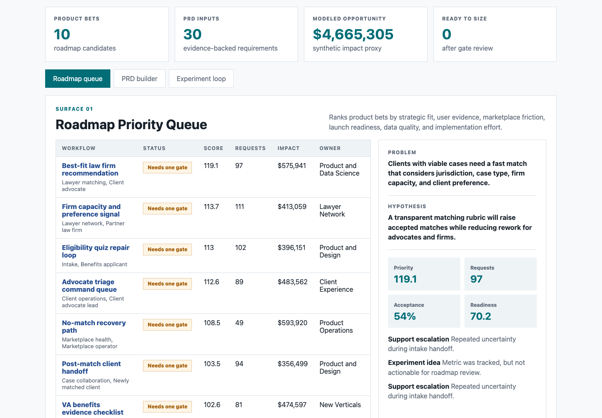
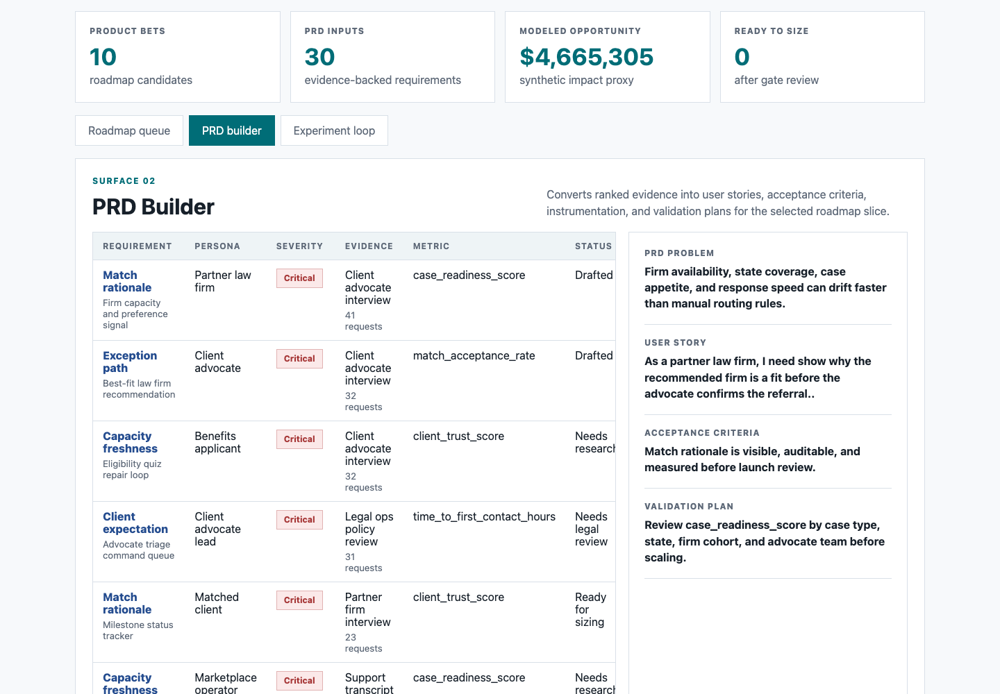
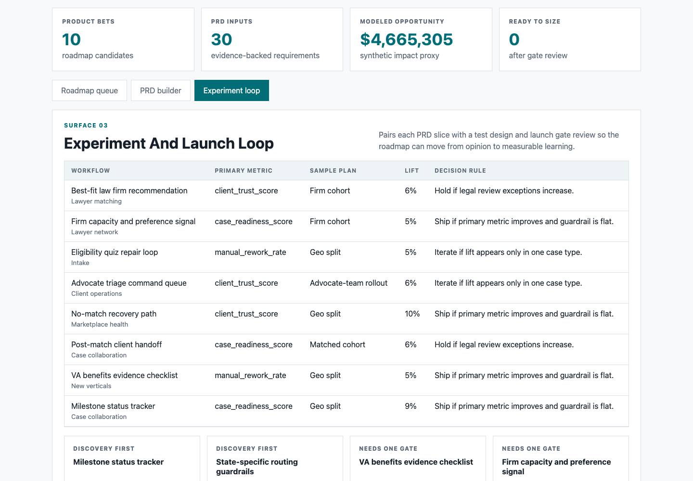

# Benefits Access Product Strategy Lab

An interactive product-management artifact for a benefits access and legal-help marketplace. It turns client intake needs, law-firm capacity constraints, stakeholder evidence, product telemetry, PRD requirements, and launch gates into a roadmap decision packet.

This is not a generic dashboard. It is a compact workbench for deciding which intake, matching, or case-collaboration problem should move from discovery to PRD, what requirements belong in that PRD, and how the launch should be measured.

## Screenshots



**Roadmap priority queue:** ranks benefits access product bets by strategic fit, user evidence, marketplace friction, launch readiness, data quality, modeled opportunity, and implementation effort.



**PRD builder:** converts the selected opportunity into a product-ready PRD slice with problem statement, user story, acceptance criteria, instrumentation, and validation plan.



**Experiment and launch loop:** pairs each PRD slice with a test design, primary metric, sample plan, decision rule, and launch gate review.

## What This Demonstrates

- Product strategy: prioritizes roadmap bets across intake, lawyer matching, evidence readiness, and case collaboration.
- PRD writing: translates user and partner evidence into user stories, acceptance criteria, instrumentation, and validation plans.
- Marketplace judgment: accounts for client urgency, firm capacity, jurisdiction fit, response time, and trust.
- Data fluency: uses transparent scoring and synthetic operating data to support roadmap tradeoffs.
- Launch discipline: connects every product bet to an experiment design and launch-readiness gate.

## Data

All datasets are synthetic and are labeled as such. The true source systems for this type of product would be private: client intake records, case attributes, law-firm capacity signals, communications, support events, legal review notes, partner feedback, and outcome data.

Generated source tables:

- `data/product_workflows.csv`: 10 product workflows across intake, lawyer matching, marketplace health, evidence readiness, case collaboration, workers compensation, and new verticals.
- `data/prd_requirements.csv`: 30 PRD-ready requirements with persona, evidence source, severity, request count, confidence, user need, instrumentation, and PRD status.
- `data/weekly_operating_metrics.csv`: 120 weekly workflow metric rows with intake starts, qualification rate, match acceptance, firm response time, client trust, case readiness, and data quality.
- `data/stakeholder_events.csv`: 60 synthetic evidence events shaped like user friction, partner firm feedback, support escalations, data gaps, policy risks, and experiment ideas.
- `data/experiment_plans.csv`: 10 experiment plans with primary metric, guardrail metric, sample plan, minimum detectable lift, and decision rule.

Synthetic assumptions:

- Match acceptance ranges from 35% to 78%, depending on workflow fit, effort, and marketplace friction.
- Firm response time ranges from 8 to 72 hours, reflecting the operational importance of speed after referral.
- Data quality ranges from 62 to 96, with lower scores increasing launch risk.
- Client trust ranges from 48 to 91, reflecting whether the product gives clear next steps during stressful legal or benefits journeys.
- Roadmap scoring combines strategic fit, client-risk sensitivity, PRD request volume, evidence severity, stakeholder event impact, match acceptance, firm response time, data quality, and implementation effort.

The data does not represent any real person, law firm, claim, client, employer, agency, insurer, or company performance.

## Analysis Outputs

- `analysis/outputs/roadmap_queue.csv`: ranked roadmap queue.
- `analysis/outputs/prd_cards.csv`: PRD slices used by the PRD Builder surface.
- `analysis/outputs/experiment_readout.csv`: experiment and launch measurement plans.
- `analysis/outputs/readiness_register.csv`: launch gate register by workflow.
- `analysis/outputs/app_payload.json`: frontend payload for the interactive workbench.
- `analysis/executive_findings.md`: concise product readout.
- `analysis/methodology.md`: scoring logic and synthetic-data methodology.
- `analysis/sql_checks.sql`: SQL-style checks for roadmap, PRD, and launch review.

## Role Connection

This artifact is designed for a product manager role that requires product vision, roadmap ownership, stakeholder alignment, hands-on data analysis, experimentation, and mission-driven judgment. It shows how to turn a complex consumer and partner marketplace into a clear product decision packet.

## Scope

This artifact does:

- Show how a product manager can structure discovery, PRD, marketplace, and launch-analysis work for a benefits access and legal-help product.
- Use a transparent scoring model that can be explained in an interview.
- Provide three distinct surfaces for roadmap prioritization, PRD creation, and experiment review.

This artifact does not:

- Claim to represent real company performance or real user data.
- Include private client, legal, medical, law-firm, benefits, revenue, or support data.
- Replace a production analytics warehouse, experimentation platform, CRM, case-management system, or legal review workflow.

## Run Locally

```bash
npm run analyze
npm run start
```

Then open `http://localhost:4173`.

Deep links are available for each surface:

- `http://localhost:4173/?surface=roadmap`
- `http://localhost:4173/?surface=prd`
- `http://localhost:4173/?surface=experiment`
